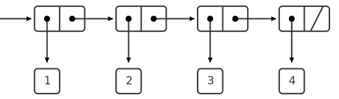

(../exercises/21/#exercise-24)
- Pairs form a primitive "glue" for compound data objects.
- We can visualize pairs with *box-and-pointer* notation. Each pair is a double box, and both sides have an arrow pointing to a primitive data object, or to another pair.
- The *closure property* of `cons` is the ability to make pairs whose elements are pairs. This allows us to create hierarchal structures.
- We have been using closure all along with combinations. Now, we are going to use closure for compound data.

> The use of the word "closure" here comes from abstract algebra, where a set of elements is said to be closed under an operation if applying the operation to elements in the set produces an element that is again an element of the set.  The Lisp community also (unfortunately) uses the word "closure" to describe a totally unrelated concept: A closure is an implementation technique for representing procedures with free variables. We do not use the word "closure" in this second sense in this book.

## Representing Sequences
- One thing we can build with pairs is a *sequence*: an ordered collection of data objects.
- Sequences can be represented by chains of pairs where each `car` points to a value and each `cdr` points the next pair. The final pair's `cdr` is a special value, `nil`.
- For example, `(cons 1 (cons 2 (cons 3 (const 4 nil))))` represents a sequence:



- This way of nesting pairs is called a *list*. We usually represent lists by placing each element one after the other and enclosing the whole thing in parentheses.
- The procedure `car` gives us the first item; `cdr` gives us the sublist containing all items but the first; `cons` returns a list with an item added to the front.
- The `nil` value can be though of as an empty list.

> In this book, we use *list* to mean a chain of pairs terminated by the end-of-list marker. In contrast, the term *list structure* refers to any data structure made out of pairs, not just to lists.

### List operations
- We can get the nth item of a list by `cdr`ing $n-1$ times, and then taking the `car`.

```scheme
(define (list-ref items n) 
  (if (= n 0) 
      (car items) 
      (list-ref (cdr items) (- n 1))))
```

- Scheme includes a a primitive predicate `null?` which is true if its argument is `nil`.
- We often write recursive procedures that `cdr` all the way through the list.

```scheme
(define (length items)
  (if (null? items)
      0
      (+ 1 (length (cdr items)))))
```

- We can build up lists to return by `cons`ing them up:

```scheme
(define (append list1 list2)
  (if (null? list1)
      list2
      (cons (car list1 (append (cdr list1) list2)))))
```

*Exercises*: [2.17](../exercises/22/#exercise-217) [2.18](../exercises/22/#exercise-218) [2.19](../exercises/22/#exercise-219) [2.20](../exercises/22/#exercise-220)
### Mapping over lists
- The higher-order procedure `map` applies the same transformation to each element in a list, producing a new list.

```scheme
(define (map f xs) 
  (if (null? xs) 
      nil 
      (cons (f (car xs)) 
            (map f (cdr xs)))))
```

- For example, `(map abs (list -1 5 -3 0 2 -2))` gives the list  `(1 5 3 0 2 2)`.
- `map` establishes a higher level of abstraction for dealing with lists; it suppressive the recursive detail. We think about the process differently when we use `map`.

> This abstraction gives us the flexibility to change the low-level details of how sequences are implemented, while preserving the conceptual framework of operations that transform sequences to sequences.

*Exercises*: [2.21](../exercises/22/#exercise-221) [2.22](../exercises/22/#exercise-222) [2.23](../exercises/22/#exercise-223)
## Hierarchical Structures
- We can represent lists whose elements themselves are also lists.
- We can also think of these structures as *trees*.
- Recursion is a natural tool for dealing with trees.
- The primitive predicate `pair?` returns true if its argument is a pair.
- We can count the number of leaves in a tree like so:

```scheme
(define (count-leaves x)
  (cond ((null? x) 0)
        ((not (pair? x)) 1)
        (else (+ (count-leaves (car x))
                 (count-leaves (cdr x))))))
```
*Exercises*: [2.24](../exercises/22/#exercise-224) [2.25](../exercises/22/#exercise-225) [2.26](../exercises/22/#exercise-226) [2.27](../exercises/22/#exercise-227) [2.28](../exercises/22/#exercise-228) [2.29](../exercises/22/#exercise-229)
### Mapping over trees
- We can deal with trees using `map` together with recursion.
- This allows us to apply an operation to all the leaves in a tree, for example.

*Exercises*: [2.30](../exercises/22/#exercise-230) [2.31](../exercises/22/#exercise-231) [2.32](../exercises/22/#exercise-232)
## Sequences as Conventional Interfaces
- Abstractions preserves the flexibility to experiment with alternative representations.
- The use of *conventional interfaces* is another powerful design principle.
- To make abstract operations for things other than numbers, we need to have a conventional style in which we manipulate data.
### Sequence operations
- We want to organize programs to reflect signal-flow structure. To do this, we focus on the signals and represent them as lists, and implement sequence operations on them.
- Expressing programs as sequence operations helps us make program designs that are *modular*—made of relatively independent pieces that we can connect in flexible ways. This is a strategy for controlling complexity.
- A surprisingly vast range of operations can be expressed as sequence operations.
- Sequences serve as a conventional interface for the modules of the program.

> One of the reasons for the success of Lisp as a programming language is that lists provide a standard medium for expressing ordered collections so that they can be manipulated using higher-order operations. The programming language APL owes much of its power and appeal to a similar choice. In APL all data are represented as arrays, and there is a universal and convenient set of generic operators for all sorts of array operations.


*Exercises*: [2.33](../exercises/22/#exercise-233) [2.34](../exercises/22/#exercise-234) [2.35](../exercises/22/#exercise-235) [2.36](../exercises/22/#exercise-236) [2.37](../exercises/22/#exercise-237) [2.38](../exercises/22/#exercise-238) [2.39](../exercises/22/#exercise-239)
### Nested mappings
- For many computations, the sequence paradigm can be used instead of loops.
- Sometimes we need *nested* mappings, where each mapping maps to a second set of mappings. We can use `mapcat` to flatten the result into on list at the end.
- The procedure for computing all permutations of a set is pure magic: this is wishful thinking in action! 

```scheme
(define (permutations s)
  (if (null? s)
      (list nil)
      (mapcat (lambda (x)
                (map (lambda (p) (cons x p))
                     (permutations (remove x s))))
              s)))
```

*Exercises*: [2.40](../exercises/22/#exercise-240) [2.41](../exercises/22/#exercise-241) [2.42](../exercises/22/#exercise-242) [2.43](../exercises/22/#exercise-243)
## Example: A Picture Language
- In this section, we will create a simple language for drawing pictures.
- The data objects are represented as procedures, not as list structure.
### The picture language
- There is only one kind of element, call a *painter*.
- The painter draws an image transformed into a parallelogram.
- We combine images with operations like `beside` and `below`.
- We transform single images with operations like `flip-vert` and `flip-horiz`.
- We can build up complexity easily thanks to closure: the painters are closed under the language's means of combination. For example:

```scheme
(define (flipped-pairs painter)
  (let ((painter2 (beside painter (flip-vert painter))))
    (below painter2 painter2)))
```
*Exercises*: [2.44](../exercises/22/#exercise-244)
### Higher-order operations
- Just as we have higher-order procedures, we can have higher-order painter operations.
- We can manipulate the painter operations rather than manipulating the painters directly.
- Here is an example higher-order painter operation:

```scheme
(define (square-of-four tl tr bl br)
  (lambda (painter)
    (let ((top (beside (tl painter) (tr painter)))
          (bottom (beside (bl painter) (br painter))))
      (below bottom top))))
```

*Exercises*: [2.45](../exercises/22/#exercise-245) 
### Frames
- Painters paint their contents in frames.
- A frame parallelogram can be represented by an origin vector and two edge vectors.
- We will use coordinates in the unit square to specify images.
- We can use basic vector operations to map an image coordinate into a pair of coordinates within the frame.

*Exercises*:[2.46](../exercises/22/#exercise-246) [2.47](../exercises/22/#exercise-247)
### Painters
- A painter is a procedure that takes a frame as an argument and draws its image transformed to fit in the frame.
- The details of primitive painters depend on the characteristics of the graphics system.
- Representing painters as procedures creates a powerful abstraction barrier.

*Exercises*: [2.48](../exercises/22/#exercise-248) [2.49](../exercises/22/#exercise-249)

### Transforming and combining painters
- Operations on painters invoke the original painters with new frames derived from the argument frame.
- They are all based on the procedure `transform-painter`.

```scheme
(define (transform-painter painter origin corner1 corner2)
  (lambda (frame)
    (let ((m (frame-coord-map frame)))
      (let ((new-origin (m origin)))
        (painter
         (make-frame new-origin
                     (sub-vect (m corner1) new-origin)
                     (sub-vect (m corner2) new-origin)))))))
```

*Exercises*: [2.50](../exercises/22/#exercise-250) [2.51](../exercises/22/#exercise-251)
### Levels of language for robust design
- The fundamental data abstractions in the picture language are painters. Representing them as procedures makes all the tools of procedural abstraction available to us.
- This example also uses *stratified design*, the notion that a complex system should be structured as a sequence of levels.
- Each time we start a new level, we treat the old complex things as primitive black boxes and combine them.

> Stratified design helps make programs *robust*, that is, it makes it likely that small changes in a specification will require correspondingly small changes in the program.  In general, each level of a stratified design provides a different vocabulary for expressing the characteristics of the system, and a different kind of ability to change it.

*Exercises*: [2.52](../exercises/22/#exercise-252)
