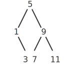

# Quotation
```scheme
(define a 1)
(define b 2)

(list a b) => '(1 2)
(list 'a 'b) => '(a b)
(list 'a b) => '(a 2)

(car '(a b c)) => 'a
(cdr '(a b c)) => '(b c)

(define (memq item x)
  (cond ((null? x) #f)
        ((eq? item (car x)) x)
        (else (memq item (cdr x)))))

(memq 'apple '(pear banana prune)) => #f
(memq 'apple '(x (apple sauce) y apple pear)) => '(apple pear)
```

## Exercise 2.53
*Imports*: [Quotation](#quotation) `memq`

```scheme
(list 'a 'b 'c) => '(a b c)
(list (list 'george)) => '((george))
(cdr '((x1 x2) (y1 y2))) => '((y1 y2))
(cadr '((x1 x2) (y1 y2))) => '(y1 y2)
(pair? (car '(a short list))) => #f
(memq 'red '((red shoes) (blue socks))) => #f
(memq 'red '(red shoes blue socks)) => '(red shoes blue socks)
```

## Exercise 2.54

```scheme
(define (equal? list1 list2)
  (cond ((null? list1) (null? list2))
        ((not (pair? list1)) (eq? list1 list2))
        (else (and (pair? list2)
                   (equal? (car list1) (car list2))
                   (equal? (cdr list1) (cdr list2))))))

(equal? '(this is a list) '(this is a list)) => #t
(equal? '(this (is a) list) '(this (is a) list)) => #t
(equal? '(this is a list) '(this (is a) list)) => #f
```

## Exercise 2.55
This happens because the Lisp reader expands each `'exp` to `(quote exp)` before evaluation, so `''abracadabra` evaluates to a list of two symbols:

```scheme
(car ''abracadabra)
=> (car (quote (quote abracadabra)))
=> (car '(quote abracadabra))
=> 'quote
```

# Example: Symbolic Differentiation

```scheme
(define (deriv expr var)
  (cond ((number? expr) 0)
        ((variable? expr)
         (if (same-variable? expr var) 1 0))
        ((sum? expr)
         (make-sum (deriv (addend expr) var)
                   (deriv (augend expr) var)))
        ((product? expr)
         (make-sum (make-product (multiplier expr)
                                 (deriv (multiplicand expr) var))
                   (make-product (deriv (multiplier expr) var)
                                 (multiplicand expr))))
        (else (error 'deriv "unknown expr type" expr))))

(define (variable? x) (symbol? x))
(define (same-variable? v1 v2)
  (and (variable? v1) (variable? v2) (eq? v1 v2)))

(define (make-sum a1 a2) (list '+ a1 a2))
(define (make-product m1 m2) (list '* m1 m2))

(define (sum? expr)
  (and (pair? expr) (eq? (car expr) '+)))
(define addend cadr)
(define augend caddr)

(define (product? expr)
  (and (pair? expr) (eq? (car expr) '*)))
(define multiplier cadr)
(define multiplicand caddr)

(deriv '(+ x 3) 'x)
=> '(+ 1 0)
(deriv '(* x y) 'x)
=> '(+ (* x 0) (* 1 y))
(deriv '(* (* x y) (+ x 3)) 'x)
=> '(+ (* (* x y) (+ 1 0))
       (* (+ (* x 0) (* 1 y))
          (+ x 3)))

(define (=number? expr num)
  (and (number? expr) (= expr num)))

(define (make-sum a1 a2)
  (cond ((=number? a1 0) a2)
        ((=number? a2 0) a1)
        ((and (number? a1) (number? a2)) (+ a1 a2))
        (else (list '+ a1 a2))))

(define (make-product m1 m2)
  (cond ((or (=number? m1 0) (=number? m2 0)) 0)
        ((=number? m1 1) m2)
        ((=number? m2 1) m1)
        ((and (number? m1) (number? m2)) (* m1 m2))
        (else (list '* m1 m2))))

(deriv '(+ x 3) 'x) => 1
(deriv '(* x y) 'x) => 'y
(deriv '(* (* x y) (+ x 3)) 'x) => '(+ (* x y) (* y (+ x 3)))
```

## Exercise 2.56
*Imports*: [Example:Symbolic Differentiation](#example-symbolic-differentiation) `=number?` `addend` `augend` `make-product` `make-sum` `multiplicand` `multiplier` `product?` `same-variable?` `sum?` `variable?`

```scheme
(define (deriv expr var)
  (cond ((number? expr) 0)
        ((variable? expr)
         (if (same-variable? expr var) 1 0))
        ((sum? expr)
         (make-sum (deriv (addend expr) var)
                   (deriv (augend expr) var)))
        ((product? expr)
         (make-sum (make-product (multiplier expr)
                                 (deriv (multiplicand expr) var))
                   (make-product (deriv (multiplier expr) var)
                                 (multiplicand expr))))
        ((exponentiation? expr)
         (make-product
          (exponent expr)
          (make-product (make-exponentiation (base expr) (- (exponent expr) 1))
                        (deriv (base expr) var))))
        (else (error 'deriv "unknown expr type" expr))))

(define (make-exponentiation b e)
  (cond ((=number? e 0) 1)
        ((=number? e 1) b)
        ((=number? b 1) 1)
        (else (list '** b e))))

(define (exponentiation? expr)
  (and (pair? expr) (eq? (car expr) '**)))
(define base cadr)
(define exponent caddr)

(deriv '(* 3 (** x 5)) 'x) => '(* 3 (* 5 (** x 4)))
```

## Exercise 2.57
*Imports*: [Sequence operations](../22/#sequence-operations) `accumulate`, [Example:Symbolic Differentiation](#example-symbolic-differentiation) `make-product` `make-sum` `product?` `same-variable?` `sum?` `variable?`

```scheme
(paste (:2.3.2 deriv))

(define addend cadr)
(define (augend sum)
  (accumulate make-sum 0 (cddr sum)))
(define multiplier cadr)
(define (multiplicand product)
  (accumulate make-product 1 (cddr product)))

(deriv '(* x y (+ x 3)) 'x) => '(+ (* x y) (* y (+ x 3)))
```

## Exercise 2.58
*Imports*: [Quotation](#quotation) `memq`, [Example:Symbolic Differentiation](#example-symbolic-differentiation) `=number?` `same-variable?` `variable?`

```scheme
(paste (:2.3.2 deriv))
```

**a.** Fully parenthesized infix form:

```scheme
(define (make-sum a1 a2)
  (cond ((=number? a1 0) a2)
        ((=number? a2 0) a1)
        ((and (number? a1) (number? a2)) (+ a1 a2))
        (else (list a1 '+ a2))))

(define (make-product m1 m2)
  (cond ((or (=number? m1 0) (=number? m2 0)) 0)
        ((=number? m1 1) m2)
        ((=number? m2 1) m1)
        ((and (number? m1) (number? m2)) (* m1 m2))
        (else (list m1 '* m2))))

(define (sum? expr)
  (and (pair? expr) (eq? (cadr expr) '+)))
(define addend car)
(define augend caddr)

(define (product? expr)
  (and (pair? expr) (eq? (cadr expr) '*)))
(define multiplier car)
(define multiplicand caddr)

(deriv '(x + (3 * (x + (y + 2)))) 'x) => 4
```

**b.** Standard algebraic notation:

```scheme
(define (has op expr)
  (and (pair? expr) (memq op expr)))

(define (unwrap expr)
  (if (and (pair? expr) (null? (cdr expr)))
      (car expr)
      expr))

(define (before op expr)
  (define (iter expr)
    (if (eq? op (car expr))
        '()
        (cons (car expr) (iter (cdr expr)))))
  (unwrap (iter expr)))

(define (after op expr)
  (unwrap (cdr (memq op expr))))

(define (sum? expr) (has '+ expr))
(define (addend expr) (before '+ expr))
(define (augend expr) (after '+ expr))

(define (product? expr) (and (not (sum? expr)) (has '* expr)))
(define (multiplier expr) (before '* expr))
(define (multiplicand expr) (after '* expr))

(deriv '(x + 3 * (x + y + 2)) 'x) => 4
(deriv '(3 * (x + y * 2) + x + 1) 'x) => 4
```

# Example: Representing Sets

### Sets as unordered lists

```scheme
(define (element-of-set? x set)
  (and (not (null? set))
       (or (equal? x (car set))
           (element-of-set? x (cdr set)))))

(define (adjoin-set x set)
  (if (element-of-set? x set)
      set
      (cons x set)))

(define (intersection-set set1 set2)
  (cond ((null? set1) '())
        ((null? set2) '())
        ((element-of-set? (car set1) set2)
         (cons (car set1)
               (intersection-set (cdr set1) set2)))
        (else (intersection-set (cdr set1) set2))))

(adjoin-set 1 '()) => '(1)
(adjoin-set 1 '(1)) => '(1)
(adjoin-set 1 '(2 3)) => '(1 2 3)

(element-of-set? 1 '()) => #f
(element-of-set? 1 '(1)) => #t
(element-of-set? 1 '(3 2 1)) => #t

(intersection-set '() '(1 2)) => '()
(intersection-set '(1) '(1 2)) => '(1)
(intersection-set '(2) '(1 2)) => '(2)
(intersection-set '(2 1) '(1 2)) => '(2 1)
```

## Exercise 2.59
**Imports**: [Sequence operations](../22/#sequence-operations) `accumulate`, [Sets as unordered list](#sets-as-unordered-lists) `adjoin-set` 

```scheme
(define (union-set set1 set2)
  (accumulate adjoin-set set2 set1))

(union-set '() '(1 2 3)) => '(1 2 3)
(union-set '(1 2 3) '()) => '(1 2 3)
(union-set '(1 2) '(2 3)) => '(1 2 3)
```

## Exercise 2.60
To allow duplicates, we only need to change `adjoin-set` and `union-set`:

```scheme
(define adjoin-set cons)
(define union-set append)
```

To compare the efficiency of each representation, let $n$ be the number of unique elements in the set, and let $k$ be the duplication factor (so the list contains $kn$ elements in total).

| Procedure        | Non-duplicate  | Duplicate               |
|------------------|----------------|-------------------------|
| `adjoin-set`     | $\Theta(n)$    | $\Theta(1)$             |   
| `union-set`      | $\Theta(n^2)$  | $\Theta(kn)$            |   
| `element-of-set?`| $\Theta(n)$    | $\Theta(kn)$            |   
| `intersection-set`| $\Theta(n^2)$ | $\Theta((kn)^2)$        |   

Which representation is more efficient depends on $k$. If it’s small, meaning inserting a duplicate is rare, then allowing duplicates is more efficient. For general use, it’s best to disallow duplicates because $k$ is unbounded and we cannot predict it.

### Sets as ordered lists 

```scheme
(define (element-of-set? x set)
  (and (not (null? set))
       (<= (car set) x)
       (or (= (car set) x)
           (element-of-set? x (cdr set)))))

(define (intersection-set set1 set2)
  (if (or (null? set1) (null? set2))
      '()
      (let ((x1 (car set1))
            (x2 (car set2)))
        (cond ((= x1 x2) (cons x1 (intersection-set (cdr set1) (cdr set2))))
              ((< x1 x2) (intersection-set (cdr set1) set2))
              (else (intersection-set set1 (cdr set2)))))))

(element-of-set? 2 '()) => #f
(element-of-set? 2 '(2)) => #t
(element-of-set? 2 '(1 2 3)) => #t

(intersection-set '() '(1 2)) => '()
(intersection-set '(1) '(1 2)) => '(1)
(intersection-set '(2) '(1 2)) => '(2)
(intersection-set '(1 2) '(1 2)) => '(1 2)
```

## Exercise 2.61

```scheme
(define (adjoin-set x set)
  (cond ((null? set) (list x))
        ((= x (car set)) set)
        ((< x (car set)) (cons x set))
        (else (cons (car set) (adjoin-set x (cdr set))))))

(adjoin-set 1 '()) => '(1)
(adjoin-set 1 '(1)) => '(1)
(adjoin-set 2 '(1)) => '(1 2)
(adjoin-set 2 '(1 3)) => '(1 2 3)
```

## Exercise 2.62

```scheme
(define (union-set set1 set2)
  (cond ((null? set1) set2)
        ((null? set2) set1)
        (else
         (let ((x1 (car set1))
               (x2 (car set2)))
           (cond ((= x1 x2) (cons x1 (union-set (cdr set1) (cdr set2))))
                 ((< x1 x2) (cons x1 (union-set (cdr set1) set2)))
                 (else (cons x2 (union-set set1 (cdr set2)))))))))

(union-set '() '(1 2 3)) => '(1 2 3)
(union-set '(1 2 3) '()) => '(1 2 3)
(union-set '(1 2) '(2 3)) => '(1 2 3)
```

### Sets as binary trees

```scheme
(define make-tree list)
(define entry car)
(define left-branch cadr)
(define right-branch caddr)

(define (element-of-set? x set)
  (and (not (null? set))
       (or (= x (entry set))
           (and (< x (entry set))
                (element-of-set? x (left-branch set)))
           (and (> x (entry set))
                (element-of-set? x (right-branch set))))))

(define (adjoin-set x set)
  (cond ((null? set) (make-tree x '() '()))
        ((= x (entry set)) set)
        ((< x (entry set))
         (make-tree (entry set)
                    (adjoin-set x (left-branch set))
                    (right-branch set)))
        ((> x (entry set))
         (make-tree (entry set)
                    (left-branch set)
                    (adjoin-set x (right-branch set))))))

(adjoin-set 1 '()) => '(1 () ())
(adjoin-set 1 '(1 () ())) => '(1 () ())
(adjoin-set 1 '(2 () (3 () ()))) => '(2 (1 () ()) (3 () ()))

(element-of-set? 1 '()) => #f
(element-of-set? 1 '(1 () ())) => #t
(element-of-set? 1 '(2 (1 () ()) (3 () ()))) => #t
```

## Exercise 2.63
*Imports*: [Sets as binary trees](#sets-as-binary-trees) `entry` `left-branch` `right-branch`

```scheme
(define (tree->list-1 tree)
  (if (null? tree)
      '()
      (append (tree->list-1 (left-branch tree))
              (cons (entry tree)
                    (tree->list-1 (right-branch tree))))))

(define (tree->list-2 tree)
  (define (copy-to-list tree result-list)
    (if (null? tree)
        result-list
        (copy-to-list (left-branch tree)
                      (cons (entry tree)
                            (copy-to-list (right-branch tree)
                                          result-list)))))
  (copy-to-list tree '()))
```

Here are the trees from Figure 2.16, all representing the set $\{1,3,5,7,9,11\}$:

```scheme
(define t1 '(7 (3 (1 () ()) (5 () ())) (9 () (11 () ()))))
(define t2 '(3 (1 () ()) (7 (5 () ()) (9 () (11 () ())))))
(define t3 '(5 (3 (1 () ()) ()) (9 (7 () ()) (11 () ()))))
```

**a.** Yes, the two procedures produce the same result for every tree. In particular, they produce the ordered list representation of the set. The first performs an in-order traversal and appends intermediate results (left to right), while the second performs a reverse in-order traversal and prepends elements to the result (right to left).

```scheme
(tree->list-1 t1)
=> (tree->list-2 t1)
=> (tree->list-1 t2)
=> (tree->list-2 t2)
=> (tree->list-1 t3)
=> (tree->list-2 t3)
=> '(1 3 5 7 9 11)
```

**b.** The first procedure does linear work at each node, so it grows as $\Theta(n \log n)$ for a balanced tree. The second procedure does constant work at each node, so it grows as $\Theta(n)$ for any tree whether balanced or not. The second procedure is more efficient.

## Exercise 2.64 
*Imports*: [Sets as binary trees](#sets-as-binary-trees) `make-tree`

```scheme
(define (list->tree elements)
  (car (partial-tree elements (length elements))))

(define (partial-tree elts n)
  (if (= n 0)
      (cons '() elts)
      (let* ((left-size (quotient (- n 1) 2))
             (left-result (partial-tree elts left-size))
             (left-tree (car left-result))
             (non-left-elts (cdr left-result))
             (this-entry (car non-left-elts))
             (right-size (- n (+ left-size 1)))
             (right-result (partial-tree (cdr non-left-elts) right-size))
             (right-tree (car right-result))
             (remaining-elts (cdr right-result)))
        (cons (make-tree this-entry left-tree right-tree)
              remaining-elts))))

(list->tree '(1 3 5 7 9 11))
=> '(5 (1 () (3 () ())) (9 (7 () ()) (11 () ())))
```

**a.** The procedure `partial-tree` works by partitioning the first `n` elements of `elts` around a central element and recursively producing left and right subtrees. It uses truncated division to work when `n` is even or odd. It passes on the list of remaining elements to avoid re-traversing the list. Here is the tree it produces for the example:



**b.** The procedure `list->tree` does constant work at each node, so it grows as $\Theta(n)$.

## Exercise 2.65
*Imports*: [Sets as ordered lists](#sets-as-ordered-lists) `intersection-set`, [Exercise 2.62](#exercise-262) `union-set`, [Exercise 2.63](#exercise-263) `tree->list-2`, [Exercise 2.64](#exercise-264) `list->tree`

We can convert the balanced binary tree to an ordered list, use the `union-set` and `intersection-set` we already implemented for ordered lists, and then convert back to a tree. This is 
$\Theta(n)$ because each step is linear.

```scheme
(define (union-tree set1 set2)
  (list->tree (union-set (tree->list-2 set1) (tree->list-2 set2))))

(define (intersection-tree set1 set2)
  (list->tree (intersection-set (tree->list-2 set1) (tree->list-2 set2))))

(define t1 '(1 () ()))
(define t2 '(2 () ()))
(define t23 '(2 () (3 () ())))
(define t123 '(2 (1 () ()) (3 () ())))

(union-tree '() t123) => t123
(union-tree t123 '()) => t123
(union-tree t123 t123) => t123
(union-tree t1 t23) => t123
(union-tree t2 t23) => t23
(union-tree t23 t123) => t123

(intersection-tree '() t123) => '()
(intersection-tree t123 '()) => '()
(intersection-tree t1 t123) => t1
(intersection-tree t2 t123) => t2
(intersection-tree t123 t123) => t123
(intersection-tree t23 t123) => t23
```

### Sets and information retrieval

```scheme
(define (lookup given-key set-of-records)
  (cond ((null? set-of-records) #f)
        ((equal? given-key (key (car set-of-records)))
         (car set-of-records))
        (else (lookup given-key (cdr set-of-records)))))

(define key car)

(lookup 3 '((1 flour) (2 water) (3 salt))) => '(3 salt)
```

## Exercise 2.66
*Imports*: [Sets as binary trees](#sets-as-binary-trees) `entry` `left-branch` `right-branch`, [Sets and information retrieval](#sets-and-information-retrieval) `key`

```scheme
(define (lookup given-key set-of-records)
  (if (null? set-of-records)
      #f
      (let* ((record (entry set-of-records))
             (rec-key (key record)))
        (cond ((= given-key rec-key) record)
              ((< given-key rec-key)
               (lookup given-key (left-branch set-of-records)))
              ((> given-key rec-key)
               (lookup given-key (right-branch set-of-records)))))))

(lookup 3 '((2 water) ((1 flour) () ()) ((3 salt) () ()))) => '(3 salt)
```

# Example: Huffman Encoding Trees

### Representing Huffman trees

```scheme
(define (make-leaf symbol weight) (list 'leaf symbol weight))
(define (leaf? object) (eq? (car object) 'leaf))
(define symbol-leaf cadr)
(define weight-leaf caddr)

(define (make-code-tree left right)
  (list left
        right
        (append (symbols left) (symbols right))
        (+ (weight left) (weight right))))
(define left-branch car)
(define right-branch cadr)

(define (symbols tree)
  (if (leaf? tree)
      (list (symbol-leaf tree))
      (caddr tree)))
(define (weight tree)
  (if (leaf? tree)
      (weight-leaf tree)
      (cadddr tree)))
```

### The decoding procedure
*Imports*: [Representing Huffman trees](#representing-huffman-trees) `leaf?` `left-branch` `right-branch` `symbol-leaf` 

```scheme
(define (decode bits tree)
  (define (decode-1 bits current-branch)
    (if (null? bits)
        '()
        (let ((next-branch (choose-branch (car bits) current-branch)))
          (if (leaf? next-branch)
              (cons (symbol-leaf next-branch)
                    (decode-1 (cdr bits) tree))
              (decode-1 (cdr bits) next-branch)))))
  (decode-1 bits tree))

(define (choose-branch bit branch)
  (cond ((= bit 0) (left-branch branch))
        ((= bit 1) (right-branch branch))
        (else (error 'choose-branch "bit should be 0 or 1" bit))))
```

### Sets of weighted elements
*Imports*: [Representing Huffman trees](#representing-huffman-trees) `make-leaf` `weight`

```scheme
(define (adjoin-set x set)
  (cond ((null? set) (list x))
        ((< (weight x) (weight (car set)))
         (cons x set))
        (else (cons (car set)
                    (adjoin-set x (cdr set))))))

(define (make-leaf-set pairs)
  (if (null? pairs)
      '()
      (let ((pair (car pairs)))
        (adjoin-set (make-leaf (car pair) (cadr pair))
                    (make-leaf-set (cdr pairs))))))
```

## Exercise 2.67
*Imports*: [Representing Huffman trees](#representing-huffman-trees) `make-code-tree` `make-leaf`, [The decoding procedure](#the-decoding-procedure) `decode`

```scheme
(define sample-tree
  (make-code-tree (make-leaf 'A 4)
                  (make-code-tree (make-leaf 'B 2)
                                  (make-code-tree (make-leaf 'D 1)
                                                  (make-leaf 'C 1)))))

(define sample-message '(0 1 1 0 0 1 0 1 0 1 1 1 0))
(define sample-decoded '(A D A B B C A))

(decode sample-message sample-tree) => sample-decoded
(decode '(0 1 2) sample-tree) =!> "bit should be 0 or 1: 2"
```

## Exercise 2.68
*Imports*: [Sets as unordered lists](#sets-as-unordered-lists) `element-of-set?`, [Representing Huffman trees](#representing-huffman-trees) `leaf?` `left-branch` `right-branch` `symbols`, [Exercise 2.67](#exercise-267) `sample-decoded` `sample-message` `sample-tree`

```scheme
(define (encode message tree)
  (if (null? message)
      '()
      (append (encode-symbol (car message) tree)
              (encode (cdr message) tree))))

(define (encode-symbol symbol tree)
  (cond ((leaf? tree) '())
        ((element-of-set? symbol (symbols (left-branch tree)))
         (cons 0 (encode-symbol symbol (left-branch tree))))
        ((element-of-set? symbol (symbols (right-branch tree)))
         (cons 1 (encode-symbol symbol (right-branch tree))))
        (else (error 'encode-symbol "symbol not in tree" symbol))))

(encode sample-decoded sample-tree) => sample-message
(encode '(Z) sample-tree) =!> "symbol not in tree: Z"
```

## Exercise 2.69
*Imports*: [Representing Huffman trees](#representing-huffman-trees) `make-code-tree`, [Sets of weighted elements](#sets-of-weighted-elements) `adjoin-set` `make-leaf-set`, [Exercise 2.68](#exercise-268) `encode-symbol`

```scheme
(define (generate-huffman-tree pairs)
  (successive-merge (make-leaf-set pairs)))

(define (successive-merge set)
  (if (null? (cdr set))
      (car set)
      (successive-merge
       (adjoin-set (make-code-tree (car set) (cadr set))
                   (cddr set)))))

(define abcd-tree (generate-huffman-tree '((A 5) (B 10) (C 2) (D 1))))
(encode-symbol 'A abcd-tree) => '(0 1)
(encode-symbol 'B abcd-tree) => '(1)
(encode-symbol 'C abcd-tree) => '(0 0 1)
(encode-symbol 'D abcd-tree) => '(0 0 0)
```

## Exercise 2.70
[Exercise 2.68](#exercise-268) `encode`, [Exercise 2.69](#exercise-269) `generate-huffman-tree`

```scheme
(define rock-tree
  (generate-huffman-tree
   '((a 2) (boom 1) (get 2) (job 2) (na 16) (sha 3) (yip 9) (wah 1))))

(define song
  '(get a job sha na na na na na na na na
    get a job sha na na na na na na na na
    wah yip yip yip yip yip yip yip yip yip
    sha boom))

(define encoded-song (encode song rock-tree))
(length encoded-song) => 84
encoded-song
=> '(1 1 1 1 1 1 1 0 0 1 1 1 1 0 1 1 1 0 0 0 0 0 0 0 0 0 1 1 1 1 1 1 1 0 0 1 1 1
     1 0 1 1 1 0 0 0 0 0 0 0 0 0 1 1 0 1 0 1 0 1 0 1 0 1 0 1 0 1 0 1 0 1 0 1 0 1
     1 1 0 1 1 0 1 1)
```

This encoding requires 84 bits. A fixed-length code for the eight-symbol alphabet would require $\log_2 8 = 3$ bits per symbol, and the song uses 36 symbols, so the fixed-length coded message would need at least $3 \times 36 = 108$ bits. Using the variable-length encoding saves about 22% storage.

## Exercise 2.71
[Exercise 2.68](#exercise-268) `encode`, [Exercise 2.69](#exercise-269) `generate-huffman-tree`
Given an alphabet of $n$ symbols whose relative frequencies are consecutive powers of two, the Huffman tree will have a diagonal shape with every right branch going to a leaf. Here are the trees with leaf weights shown for 5 and 10 symbols:


The tree looks like this because the merging algorithm ends up accumulating everything into one tree. At each stage, the weight of the tree is less than the weight of the next leaf. For example, $1+2<4$, and in general $2^0 + \dots + 2^{k-1} = 2^k - 1 < 2^k$.

In this encoding, the most frequent symbol requires one bit and the least frequent symbol requires $n-1$ bits. We can verify this for a random $n$:

```scheme
(define (alphabet-frequencies n)
  (define (helper i)
    (if (> i n)
        '()
        (cons (list i (expt 2 (- n i))) (helper (+ i 1)))))
  (helper 1))

(alphabet-frequencies 5)
=> '((1 16) (2 8) (3 4) (4 2) (5 1))

(define n (+ 2 (random 25)))
(define tree (generate-huffman-tree (alphabet-frequencies n)))

(encode-symbol 1 tree) => '(1)
(length (encode-symbol n tree)) => (- n 1)
```

In the special case where $n=1$, the lone symbol requires zero bits: 

```scheme
(define tree (generate-huffman-tree (alphabet-frequencies 1)))
(encode-symbol 1 tree) => '()
```

## Exercise 2.72
The `encode-symbol` procedure from [Exercise 2.68](#exercise-268) grows as $\Theta(1)$ in the best case, when taking the first left branch to a leaf, and $\Theta(n^2)$ in the worst case, when visiting every non-leaf node. Assuming a tree as described in Exercise 2.71, it is $\Theta(n)$ for the most frequent symbol due to scanning the left branch’s symbols first, and $\Theta(n^2)$ for the least frequent symbol as this is the worst case just described.